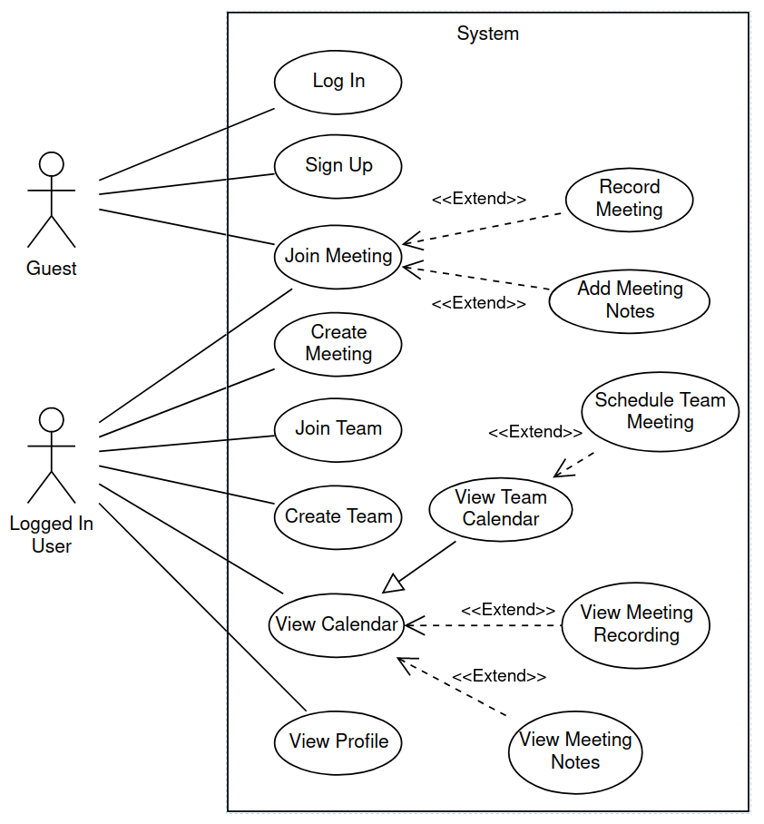
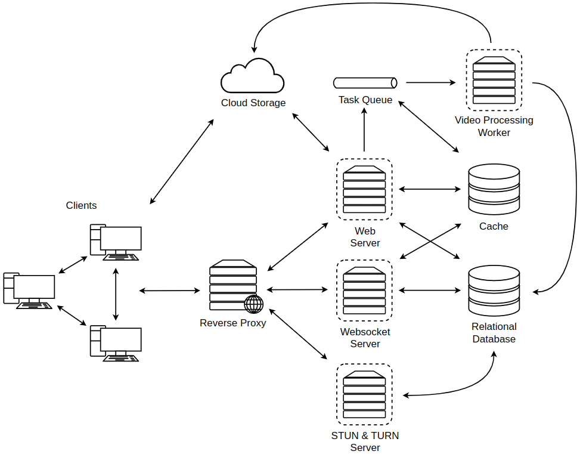
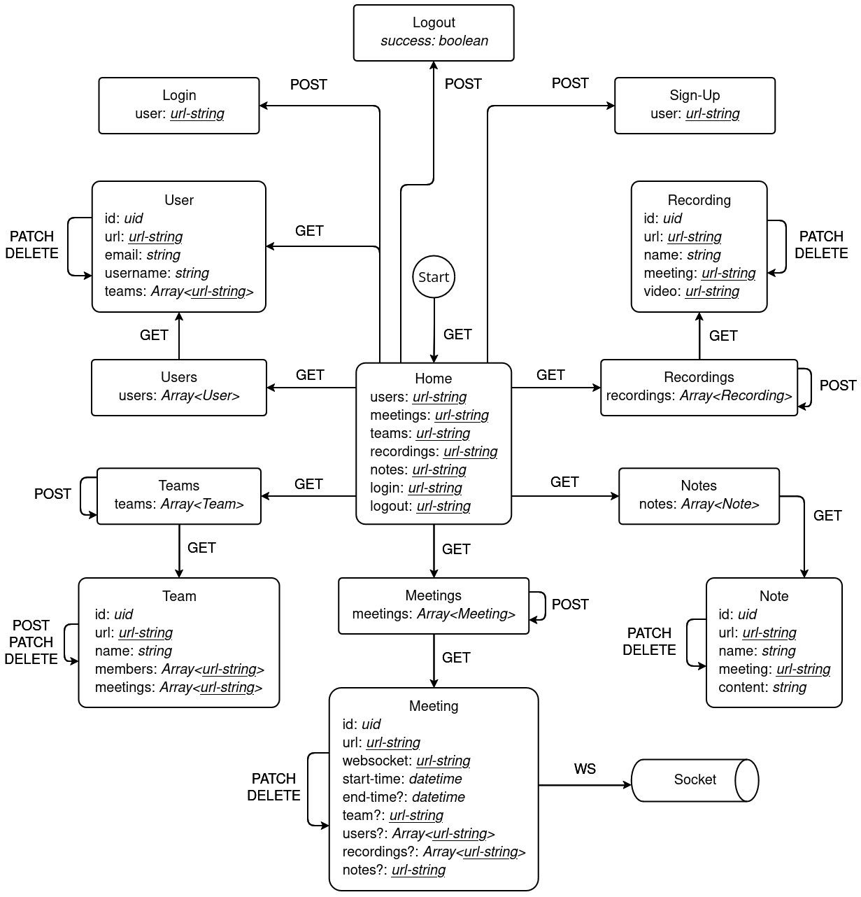
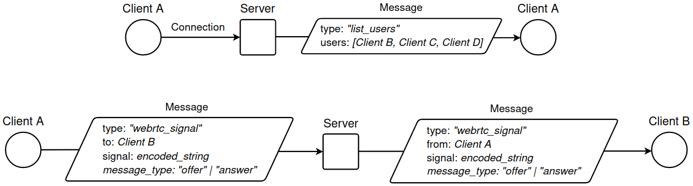
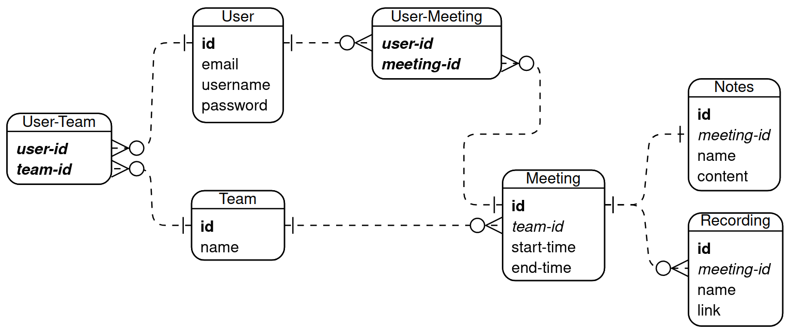
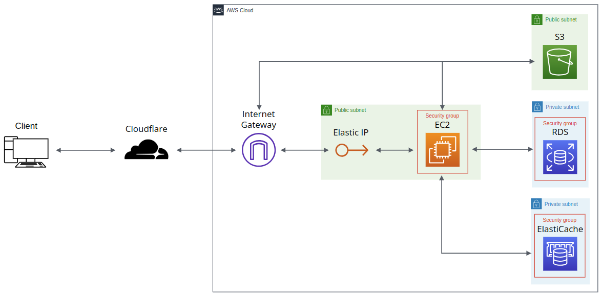

# Dictate - Video-conferencing for small meetings and groups

## About

With advancements in technology, the usage of video-conference systems in
businesses and in particular meetings has rapidly grown. Meetings have the
potential to be highly productive mediums whilst, conversely, also have the
potential to be the means to waste a company’s time and resources.

Dictate is a browser application created to investigate the effect collaborative tools
have on the productivity and enjoyment of video-conference meetings.
Implementing live group notes and meeting recordings paired with team calendars;
a variety of tools were designed, implemented and later tested.

Feedback suggested advancements in video-conference technologies would push
more individuals to choose a video-conference in the future and showed a positive
correlation between the advancements in UI/UX design and user satisfaction.

https://github.com/user-attachments/assets/da67ad8e-6fcb-4647-83b6-7aefdf0d7bfa

### How It Works

The full project report and accompanying video showcase can be found in the **docs** folder ([project report](/docs/project-report.pdf) and [video showcase - download required](/docs/project-video-submission.mp4)). Selected diagrams are copied below as a summary.

#### Use Case Model



#### System Architecture



#### API Diagram



#### Websockets



#### Database



#### Deployment



## Running the app

### Develoment

#### Docker

- go to http://localhost/

  ```console
  $ docker compose -f docker-compose.dev.yaml up
  ```

#### Outside Docker - for HMR (Hot Module Reload)

- create virtual env

  ```console
  $ virtualenv venv
  $ . venv/bin/activate
  $ pip install -r requirements.txt
  ```

- build project

  ```console
  $ python manage.py setup_db
  $ python manage.py seed
  ```

- go to http://localhost:8000/api/ (api)

  ```console
  $ python manage.py runserver
  ```

- go to http://localhost:5137/ (web)

  ```console
  $ cd react
  $ npm install
  $ npm run dev
  ```

### Production

#### Setup

1. Create security groups (for linking resources later)

   - Postgres security group (e.g. dictate_postgres_backend)

     | Direction | Port(s)     | Destination(s) |
     | --------- | ----------- | -------------- |
     | Inbound   | 5432        | self           |
     | Outbound  | All Traffic | All Addresses  |

   - Redis security group (e.g. dictate_redis_backend)

     | Direction | Port(s)     | Destination(s) |
     | --------- | ----------- | -------------- |
     | Inbound   | 6379        | self           |
     | Outbound  | All Traffic | All Addresses  |

   - EC2 security group (e.g. dictate_ec2_backend)

     | Direction | Port(s)     | Destination(s) |
     | --------- | ----------- | -------------- |
     | Inbound   | HTTPS (443) | All Addresses  |
     | Inbound   | HTTP (80)   | All Addresses  |
     | Inbound   | SSH (22)    | All Addresses  |
     | Outbound  | All Traffic | All Addresses  |

   - Notes:
     - first create an empty security group then edit to be able to select destination=self
     - other methods:
       - create a PostgresPublic group which allows traffic from all addresses
         - when creating ec2 instance then add rule to it's default security group to allow inbound postgres traffic
         - same for RedisPublic group
       - create a PostgresDictate group with allows traffic from ec2 group only
         - when creating ec2 instance then add rule to it's default security group to allow inbound postgres traffic
         - same for RedisPublic group

2. Create an EC2 instance to host app

   - Config:
     - Attach a key-pair for ssh
     - Allow ssh from anywhere
     - Allow https & http
     - Add Postgres, Redis and Ec2 security groups
   - Post creation:
     - Setup Elastic IP
   - Notes:
     - works with t3.small
     - create RSA key pair and save .pem file to ~/.ssh/
       - add following to ~/.ssh/config to automatically use key-pair
         > Host ec2-\*.compute.amazonaws.com ssh.dictate.com  
         > &nbsp;&nbsp;&nbsp;&nbsp;IdentityFile ~/.ssh/my_aws_file.pem
     - ssh using into machine with:
       ```console
       $ ssh ubuntu@<ec2_address>
       ```
     - after setting up DNS (later on)
       ```console
       $ ssh ubuntu@ssh.dictate.com
       ```
   - Commands inside machine:

     ```console
     $ sudo apt update -y && sudo apt upgrade -y
     $ sudo apt install -y apt-transport-https ca-certificates curl software-properties-common git certbot postgresql-client

     $ curl -fsSL https://download.docker.com/linux/ubuntu/gpg | sudo gpg --dearmor -o /usr/share/keyrings/docker-archive-keyring.gpg
     $ echo "deb [arch=amd64 signed-by=/usr/share/keyrings/docker-archive-keyring.gpg] https://download.docker.com/linux/ubuntu $(lsb_release -cs) stable" | sudo tee /etc/apt/sources.list.d/docker.list > /dev/null
     $ sudo apt update -y
     $ sudo apt install -y docker-ce docker-ce-cli containerd.io

     $ git clone https://github.com/<username>/<repo>.git
     ```

     - `$ sudo reboot` - is this needed?

3. Create a postgres RDS instance for db

   - Config:
     - make sure to create initial table (e.g. dictate_core)
     - don't connect to ec2 instance
     - add Postgres security group
   - Post creation:
     - setup relay server db (from local machine or from ec2 instance (depends on security group config))
       ```console
       $ psql -h database_endpoint -U username -d intial_table -f coturn/coturn_schema.sql -a
       ```

4. Create an Elasticache redis cluster for cache

   - Config:
     - cluster mode disabled
     - create subnet with same vpc as ec2 instance
     - add Redis security group
     - backups not needed (?)
   - Notes:
     - free tier (t3.micro)

5. Create an S3 instance for recording storage

   - Pre-Creation:
     - create IAM user for app to upload to bucket
       - User access not required for AWS console
       - Policies: AmazonS3FullAccess
       - Create Access Key for AWS Compute Services (i.e. EC2)
   - Config:
     - allow all IPs to GET bucket resources
   - Post-Creation:
     - Update Permissions -> CORS
       ```json
       [
         {
           "AllowedHeaders": ["*"],
           "AllowedMethods": ["GET"],
           "AllowedOrigins": ["*"],
           "ExposeHeaders": []
         }
       ]
       ```

6. Setup domain name

   - use cloudflare (if you want)
   - add dns records for <domain_name>, stun.<domain_name> and turn.<domain_name>
   - optionally add ssh.<domain_name>
     - if using cloudflare disabled proxy

7. Setup TLS

   - create certs inside ec2 instance (run nginx then certbot in separate process):

     ```console
     $ docker run -p 80:80 -p 443:443 \
         -v $(pwd)/nginx/nginx.certbot.conf:/etc/nginx/nginx.conf:ro \
         -v $(pwd)/certbot/www/:/var/www/certbot/:ro \
         -v $(pwd)/certbot/conf/:/etc/nginx/ssl/:ro \
         nginx:1.25.3-alpine3.18
     ```

     ```console
     $ docker run --rm \
         -it \
         -v $(pwd)/certbot/www/:/var/www/certbot/:rw \
         -v $(pwd)/certbot/conf/:/etc/letsencrypt/:rw \
         certbot/certbot:latest certonly --webroot \
         --webroot-path /var/www/certbot/ \
         --dry-run -d <domain_name>
     ```

     - `--dry-run` flag for testing first

8. Fill in .env file

   - reminder: whenever we change this file we need to rebuild the docker image

9. Run setup db script
   - runs migrations and creates superuser
   ```console
   $ docker compose run --rm setup python manage.py setup_db
   ```

Important Reminders

- whenever we change files we need to rebuild the docker image
- prune unused images/containers to save space on vm
  - get overall memory usage for docker (with reclaimable space)
    - `$ docker system df`
  - removes build cache
    - `$ docker builder prune`

#### Running the server

```console
$ docker compose up -d
```

- go to http://<domain_name>/

### Testing

#### Setup

- Run the project locally

  ```console
  $ docker compose -f docker-compose.dev.yaml up
  ```

#### Running tests (in a separate process)

- open test application for detailed view

  ```console
  $ cd react && npm run test
  ```

- run end-to-end tests from command line
  ```console
  $ cd react && npm run test:e2e
  ```
